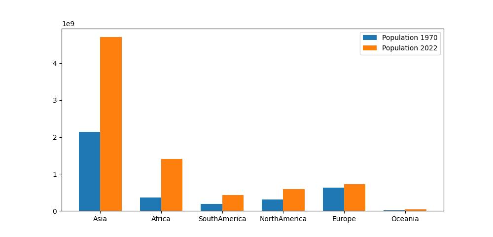

# world-population-py
## Project Description:
- this program retrieves data from a file (name given by the user), which contains population data from 1970 to 2022 for each country (file name: World Population.txt)
- the program performs calculations on data (such as the percentage change in population between 1970 and 2022 for each continent, the share of each continent's population in the world's population (%), etc.)
- the program creates charts on the basis of data from calculations
- the program creates a file (name and type of file given by the user) and saves data from calculations in it
## Screenshots

